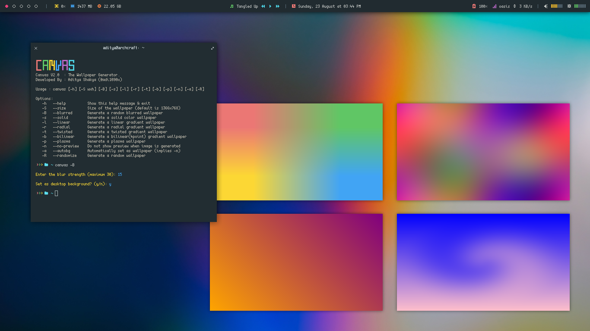
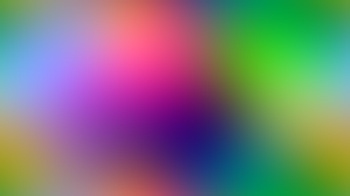
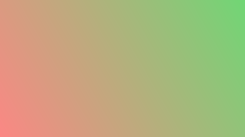
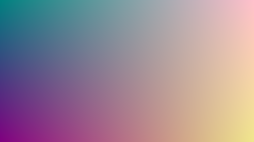
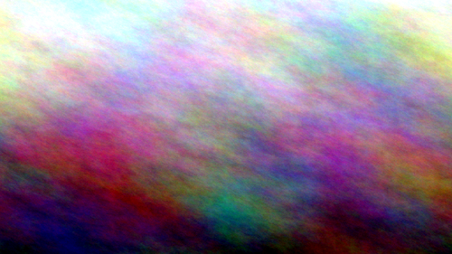
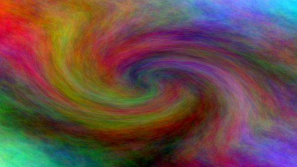
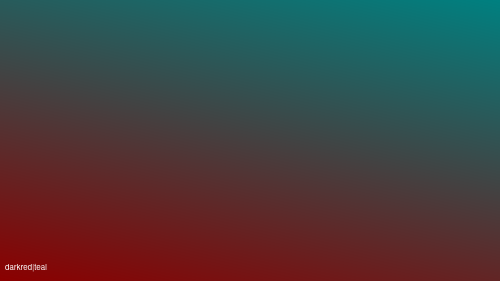

# Canvas

<p align="left">
  
  
  
  
  
</p>

A `bash` script to generate and apply different types of **gradient** & **blured** wallpapers.



### About this fork
I changed `gpick` for `zenity` because the first program doesn't work on wayland (at least on my PC).

I added the possibility to put the name of the color in the wallpaper just for fun 😁️.

I only use GNOME so I don't know if zenity will work in another DE|WM.

### Features

+ Generate a `solid color` wallpaperk
+ Generate a `random blured` wallpaper
+ Generate linear, radial, bilinear(4 colored) & twisted `gradient` wallpapers
+ Generate random, twisted or colored `plasma` wallpapers
+ Allows you to pick colors or fetch colors from `.Xresources` file for wallpaper generation
+ Add the name of the color(s) at the bottom right corner (only in solid, linear and radial gradient wallpapers)

### Dependencies

+ `imagemagick`
+ `feh`
+ `zenity`
+ `xrandr` (only if you use it on xfce)

### Installation

+ Clone this repository...
```bash
cd $HOME
git clone https://github.com/adi1090x/canvas.git
cd canvas
chmod +x canvas

# you can copy this script in bin dir for easy use
sudo cp canvas /usr/local/bin
```

+ Run the program and choose an option
```
$ ./canvas -h

┏━╸┏━┓┏┓╻╻ ╻┏━┓┏━┓
┃  ┣━┫┃┗┫┃┏┛┣━┫┗━┓
┗━╸╹ ╹╹ ╹┗┛ ╹ ╹┗━┛
Canvas V2.0  : The Wallpaper Generator.
Developed By : Aditya Shakya (@adi1090x)
This fork By : Nicolás Cualangelo

Usage : canvas [-h] [-S wxh] [-B] [-s] [-l] [-r] [-t] [-b] [-p] [-n] [-a] [-R] [-T]

Options:
   -h   --help		    Show this help message & exit
   -S   --size		    Size of the wallpaper (default is 1366x768)
   -B   --blurred	    Generate a random blurred wallpaper
   -s   --solid		    Generate a solid color wallpaper
   -l   --linear	    Generate a linear gradient wallpaper
   -r   --radial	    Generate a radial gradient wallpaper
   -t   --twisted	    Generate a twisted gradient wallpaper
   -b   --bilinear	    Generate a bilinear(4point) gradient wallpaper
   -p   --plasma	    Generate a plasma wallpaper
   -n   --no-preview	Do not show preview when image is generated 
   -a   --autobg	    Automatically set as wallpaper (implies -n)
   -R   --randomize	    Generate a random wallpaper
   -T	 --add-text     Add color name at the bottom right corner
```

### Usage

Though you can pick colors, Here's a [list](https://imagemagick.org/script/color.php#color_names) of all supported color names.

**1**. Generate random blured wallpaper...

```
$ canvas -B

Enter the blur strength (maximum 30): 12

Set as desktop background? (y/n): y
```

|Blured 1|Blured 2|
|-|-|
|||

**2**. Generate a solid color wallpaper...

```
$ canvas -s

Pick Colors or Enter Colors or fetch from .Xresources file? (p/e/x): p

Pick a color... 
Generating wallpaper with color: #BA68C8

Set as desktop background? (y/n): y

$ canvas -s

Pick Colors or Enter Colors or fetch from .Xresources file? (p/e/x): e

Enter the color name or hex (eg: teal, #EBCB8B): #A3BE8C

Set as desktop background? (y/n): y

$ canvas -s

Pick Colors or Enter Colors or fetch from .Xresources file? (p/e/x): x
 
 ██████  ██████  ██████  ██████  ██████  ██████
 ██01██  ██02██  ██03██  ██04██  ██05██  ██06██
 ██████  ██████  ██████  ██████  ██████  ██████

 ██████  ██████  ██████  ██████  ██████  ██████
 ██07██  ██08██  ██09██  ██10██  ██11██  ██12██
 ██████  ██████  ██████  ██████  ██████  ██████	 

Enter the color number (without zero): 1

Generating wallpaper with color: #BF616A

Set as desktop background? (y/n): y
```
|Solid - #BA68C8|Solid - #A3BE8C|
|-|-|
|||

**3**. Generate a linear gradient wallpaper...

```
$ canvas -l

Pick Colors or Enter Colors or fetch from .Xresources file? (p/e/x): p

Pick first color...
Pick second color...

Generating wallpaper with colors: #FB8784, #70D675

Enter the rotation angle (default is 0): 60 

Set as desktop background? (y/n): y

$ canvas -l

Pick Colors or Enter Colors or fetch from .Xresources file? (p/e/x): e

Enter the colors name or hex (format: color1-color2): orange-purple

Enter the rotation angle (default is 0): 90

Set as desktop background? (y/n): y
```

|Linear Gradient 1|Linear Gradient 2|
|-|-|
|||

**4**. Generate a radial gradient wallpaper...

```
$ canvas -r

Pick Colors or Enter Colors or fetch from .Xresources file? (p/e/x): p

Pick first color...
Pick second color...

Generating wallpaper with colors: #DA0B86, #200D74

Shape? [ 1.diagonal | 2.ellipse | 3.maximum | 4.minimum ] (1/2/3/4): 3

Enter the rotation angle (default is 0): 0

Set as desktop background? (y/n): y

$ canvas -r

Pick Colors or Enter Colors or fetch from .Xresources file? (p/e/x): e

Enter the colors name or hex (format: color1-color2): red-black

Shape? [ 1.diagonal | 2.ellipse | 3.maximum | 4.minimum ] (1/2/3/4): 2

Enter the rotation angle (default is 0): 20

Set as desktop background? (y/n): y
```

|Radial Gradient Max|Radial Gradient Ellipse|
|-|-|
|||

**5**. Generate a twisted gradient wallpaper...

```
$ canvas -t

Pick Colors or Enter Colors or fetch from .Xresources file? (p/e/x): p

Pick first color...
Pick second color...

Generating wallpaper with colors: #EC7875, #61C766

Enter the twisting amount (maximum 500): 200

Set as desktop background? (y/n): y

$ canvas -t

Pick Colors or Enter Colors or fetch from .Xresources file? (p/e/x): e

Enter the colors name or hex (format: color1-color2): blue-pink

Enter the twisting amount (maximum 500): 180

Set as desktop background? (y/n): y
```

|Twisted Gradient 1|Twisted Gradient 2|
|-|-|
|||

**6**. Generate a bilinear gradient wallpaper...

```
$ canvas -b

Pick Colors or Enter Colors or fetch from .Xresources file? (p/e/x): p

Pick first color...
Pick second color...
Pick third color...
Pick fourth color...

Generating wallpaper with colors: #FB8784, #70D675, #FFE744 & #51B4FF

Smooth or Regular? (s/r): r

Set as desktop background? (y/n): y

$ canvas -b

Pick Colors or Enter Colors or fetch from .Xresources file? (p/e/x): e

Enter first color (eg: red, #EC7875): teal
Enter second color (eg: green, #61C766): pink
Enter third color (eg: yellow, #FDD835): purple
Enter fourth color (eg: blue, #42A5F5): khaki

Smooth or Regular? (s/r): s

Please wait...
Set as desktop background? (y/n): y
```

|Bilinear 1|Bilinear 2|
|-|-|
|||

**7**. Generate a plasma wallpaper...

```
$ canvas -p

Random, Twisted or Custom colors? (r/t/c): r

Set as desktop background? (y/n): n

$ canvas -p

Random, Twisted or Custom colors? (r/t/c): t

Set as desktop background? (y/n): n
```

|Plasma Normal|Plasma Twisted|
|-|-|
|||

**8**. Add color name at the bottom right corner
```
$ canvas -s -T

Pick Colors or Enter Colors or fetch from .Xresources file? (p/e/x): p

Pick a color... 
Generating wallpaper with color: #BA68C8

Set as desktop background? (y/n): y
```

|Solid Named|Lineal Named|
|-|-|
|||

### Common Issues

1. **Wallpaper not changing** : If your wallpaper is not changing, then open an issue and show me the output of `echo $DESKTOP_SESSION`.

2. **Not working on XFCE** : If this script is not working on xfce, then open the terminal and run `xfconf-query -c xfce4-desktop -m` and change the wallpaper (any) via *xfce4-settings-manager*. <br />
In terminal, *xfconf-query* will print lines starting with `set:`, which show which properties have been changed, check `screen` & `monitor` values and modify the script accordingly.
```bash
105   ## For XFCE
106   if [[ "$OSTYPE" == "linux"* ]]; then
107       SCREEN="0"
108       MONITOR="1"
109   fi

```

### FYI

+ In KDE, it changes the wallpaper in all the Activities.
+ If you can improve it, you're welcome.
+ Have Fun!
